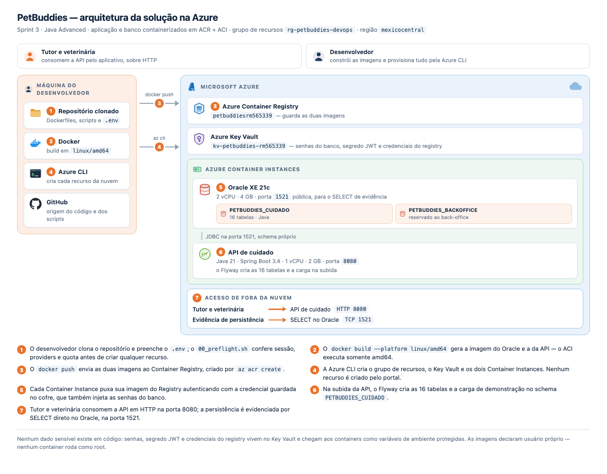

# PetBuddies — DevOps Tools & Cloud Computing | FIAP Challenge 2026, Sprint 3

> Solução containerizada completa na Azure: **ACR + ACI**, aplicação e banco em containers,
> todos os recursos criados via Azure CLI.

**Escopo desta entrega:** a Sprint 3 cobre **uma** disciplina, e a escolhida é **Java Advanced** — a
API de cuidado e o banco Oracle, ambos em container. O back-office .NET faz parte do produto, mas não
desta avaliação, e por isso não está neste repositório.

## Equipe

| Nome | RM |
|------|----|
| Felipe Yuiti Ishii | 565339 |
| Gabriel Nogueira Peixoto | 563925 |
| Giovanna Neri dos Santos | 566154 |
| Mariana Inoue | 565834 |

---

## Descrição da solução

**PetBuddies** é uma plataforma de cuidado veterinário contínuo. O tutor mantém o histórico do animal,
acompanha o plano de cuidado preventivo e recebe prescrições; a clínica registra consultas,
procedimentos e atendimentos, e configura o catálogo de protocolos que ela oferece.

O tutor entra pelo aplicativo; a veterinária usa as mesmas rotas com perfil próprio. A autenticação
é JWT, emitida pela própria API, e o histórico fica num Oracle na nuvem.

## Benefícios para o negócio

- **Cuidado preventivo deixa de depender de memória.** O plano de cuidado nasce do protocolo da clínica
  e calcula as datas de cada evento por animal — vacina, vermífugo e retorno param de ser lembrados
  por acaso.
- **O histórico clínico fica em um lugar só.** Consulta, procedimento, prescrição e atendimento
  ficam no mesmo registro, acessível ao tutor e à clínica.
- **A clínica configura o que oferece sem depender de desenvolvimento.** Protocolos, regras e ofertas
  são dados, não código.
- **Infraestrutura reproduzível.** Sete scripts recriam o ambiente inteiro do zero, e um script o
  apaga por completo.

---

## Arquitetura

| Recurso Azure | Nome | Conteúdo |
|---|---|---|
| Container Registry | `petbuddiesrm565339` | imagens do Oracle e da API |
| Key Vault | `kv-petbuddies-rm565339` | senhas do banco, segredo JWT e credenciais do registry |
| Container Instance | `rm565339-oracle` | Oracle XE 21c · 2 vCPU / 4 GB · porta 1521 |
| Container Instance | `rm565339-api-java` | Java 21 · Spring Boot 3.4 · 1 vCPU / 2 GB · porta 8080 |

Grupo de recursos `rg-petbuddies-devops`, região `chilecentral`. A autenticação é JWT, emitido pela
própria API.



O **Key Vault** guarda os nove segredos (senhas do Oracle, segredo JWT, chave da IA e credenciais do
registry). Nenhum deles aparece em script, log ou variável visível: os scripts os leem do cofre no
momento do `az container create` e os injetam como `--secure-environment-variables`.

**Um Oracle, dois schemas.** A assinatura tem limite de 6 Standard Cores na região; duas instâncias
não deixariam folga para recriar um app. Os schemas são isolados: nenhum objeto de um serviço existe
no schema do outro.

---

## How To — execução completa

### Pré-requisitos

- Azure CLI (`az`), Docker, Git, JDK 21 + Maven
- `az login` já executado

### 1. Clonar e configurar

```bash
git clone https://github.com/GNogueirovski/petbuddies-devops.git
cd petbuddies-devops
cp .env.example .env
nano .env          # preencher as senhas (só alfanuméricas, começando por letra)
```

### 2. Teste local (opcional)

Antes de subir à nuvem, o mesmo desenho roda na máquina com Docker Compose — o banco e a API, na
mesma rede:

```bash
./scripts/02_build-push.sh        # clona a API em .build/ e constrói as imagens
docker compose up -d --build
docker compose ps                 # aguardar o Oracle ficar healthy (~5 min no primeiro start)
curl http://localhost:8080/swagger-ui.html
docker compose down -v            # derruba e APAGA o volume
```

A imagem do Oracle é amd64, então em Mac ARM ela roda emulada e sobe devagar. Na nuvem é nativo.

> Cada script pode gravar a própria saída, o que deixa a evidência da execução em arquivo:
> `./scripts/01_acr.sh > 01_acr.log`. Os `.log` ficam fora do Git — eles ecoam nome de recurso e
> saída bruta da CLI.

### 3. Conferir o ambiente

```bash
./scripts/00_preflight.sh
```

Confere sessão, identidade no Graph, papel na subscription, providers, quota de ACI e colisão de nome
de Key Vault. **Nenhum recurso é criado aqui.**

### 4. Criar o registry

```bash
./scripts/01_acr.sh
```

Cria o grupo de recursos `rg-petbuddies-devops` e o ACR `petbuddiesrm565339` (SKU Basic, admin
habilitado — é com a credencial de admin que os ACIs se autenticam no registry).

### 5. Construir e publicar as imagens

```bash
./scripts/02_build-push.sh
```

Clona a API, constrói as duas imagens em `linux/amd64` e as envia ao ACR:

```bash
docker build --platform linux/amd64 -t petbuddiesrm565339.azurecr.io/rm565339-oracle-petbuddies:v1 database/
docker build --platform linux/amd64 -t petbuddiesrm565339.azurecr.io/rm565339-api-java:v1 api/
az acr login --name petbuddiesrm565339
docker push petbuddiesrm565339.azurecr.io/rm565339-oracle-petbuddies:v1
docker push petbuddiesrm565339.azurecr.io/rm565339-api-java:v1
```

### 6. Cofre de segredos

```bash
./scripts/03_key-vault.sh
```

### 7. Subir os containers

```bash
./scripts/04_aci-oracle.sh     # espera o banco abrir antes de retornar
./scripts/05_aci-java.sh
```

O schema é criado na subida da aplicação, pelo **Flyway**: 16 tabelas mais o seed de demonstração.

### 8. Carga de demonstração

```bash
sqlplus PETBUDDIES_CUIDADO/<senha>@petbuddies-oracle-rm565339.chilecentral.azurecontainer.io:1521/XEPDB1 @carga_demonstracao.sql
```

Insere dois tutores e três animais com conteúdo de negócio nas duas tabelas do CRUD, para que a
consulta já tenha o que mostrar e a alteração e a exclusão incidam sobre dados reais. Um dos tutores
leva dois animais, então o lado **N** do relacionamento aparece de fato.

Nenhum id é escrito à mão: as chaves são `GENERATED BY DEFAULT ON NULL AS IDENTITY`, e gravar um id
explícito não avança o gerador — o próximo animal criado pela aplicação colidiria com a carga. O
vínculo do animal com o dono sai de uma subconsulta pelo e-mail.

### 9. Encerrar

```bash
./scripts/99_destroy.sh
```

---

## Endereços

| Serviço | URL |
|---|---|
| API de cuidado (Swagger) | http://petbuddies-java-rm565339.chilecentral.azurecontainer.io:8080/swagger-ui.html |
| Oracle | `petbuddies-oracle-rm565339.chilecentral.azurecontainer.io:1521/XEPDB1` |

Usuários de demonstração: `maria@email.com` (tutor) e `ana@clinica.com` (veterinária), senha
`petbuddies123`.


---

## CRUD sobre duas tabelas relacionadas

O CRUD demonstrado é **`T_PB_RESPONSAVEL` → `T_PB_ANIMAL`**, um relacionamento **1:N**:

| Tabela | Lado | Chave |
|---|---|---|
| `T_PB_RESPONSAVEL` | **1** — o tutor | PK `ID_RESPONSAVEL` |
| `T_PB_ANIMAL` | **N** — os animais dele | FK `ID_RESPONSAVEL` → `T_PB_RESPONSAVEL` |

São tabelas do núcleo do produto: sem tutor e sem animal não existe cuidado de pet.

```bash
BASE=http://petbuddies-java-rm565339.chilecentral.azurecontainer.io:8080

TOKEN=$(curl -s -X POST $BASE/api/auth/login -H 'Content-Type: application/json' \
  -d '{"login":"maria@email.com","senha":"petbuddies123"}' | jq -r .token)

# CREATE
curl -X POST $BASE/api/animal -H "Authorization: Bearer $TOKEN" -H 'Content-Type: application/json' \
  -d '{"nome":"Filó","especie":"CACHORRO","porte":"MEDIO","sexo":"FEMEA",
       "dataNascimento":"2022-03-15","responsavelId":1}'

# READ
curl $BASE/api/animal/1      -H "Authorization: Bearer $TOKEN"
curl $BASE/api/responsavel/1 -H "Authorization: Bearer $TOKEN"

# UPDATE
curl -X PUT $BASE/api/animal/1 -H "Authorization: Bearer $TOKEN" -H 'Content-Type: application/json' \
  -d '{"nome":"Filó","especie":"CACHORRO","porte":"MEDIO","sexo":"FEMEA",
       "dataNascimento":"2022-03-15","peso":12.4,"responsavelId":1}'

# DELETE
curl -X DELETE $BASE/api/animal/1 -H "Authorization: Bearer $TOKEN"
```

### Acompanhar e inspecionar os containers

```bash
# saída da aplicação
az container logs --resource-group rg-petbuddies-devops --name rm565339-api-java
az container logs --resource-group rg-petbuddies-devops --name rm565339-api-java --follow

# abrir um shell dentro do container
az container exec --resource-group rg-petbuddies-devops --name rm565339-api-java --exec-command "/bin/sh"

# estado de todos os containers do grupo
az container list --resource-group rg-petbuddies-devops --output table
```

### Evidência de persistência — SELECT direto no banco

Há dois caminhos, e os dois valem como evidência.

**a) Pelo próprio container**, sem instalar nada na máquina — o `sqlplus` já vive na imagem:

```bash
az container exec --resource-group rg-petbuddies-devops --name rm565339-oracle \
  --exec-command "/bin/bash"

# já dentro do container:
sqlplus PETBUDDIES_CUIDADO/<senha>@localhost:1521/XEPDB1
```

**b) De um cliente externo** (SQL Developer, DataGrip), conectando em `petbuddies-oracle-rm565339.chilecentral.azurecontainer.io:1521/XEPDB1` com o usuário
`PETBUDDIES_CUIDADO` e execute, após cada operação:

```sql
SELECT a.ID_ANIMAL, a.NM_NOME_ANIMAL, a.TP_ESPECIE, a.PS_PESO,
       r.NM_NOME_RESPONSAVEL, r.EM_EMAIL
  FROM T_PB_ANIMAL a
  JOIN T_PB_RESPONSAVEL r ON r.ID_RESPONSAVEL = a.ID_RESPONSAVEL
 ORDER BY a.ID_ANIMAL;
```

O DDL completo das tabelas está em [`script_bd.sql`](script_bd.sql).

---

## Segurança

- **Nenhum dado sensível no código-fonte.** Senhas, segredo JWT e chave de IA vivem no `.env`
  (ignorado pelo Git) e no **Key Vault**. Os scripts os leem do cofre e os passam ao ACI por
  `--secure-environment-variables`, que não são devolvidas por `az container show`.
- **Containers sem privilégio administrativo.** As imagens criam um usuário próprio e declaram
  `USER` antes do entrypoint — nenhuma roda como root.
- `*.log` e `.env` estão no `.gitignore`.

---

## Notas de implementação

**`az acr build` não é usado.** ACR Tasks é bloqueado nesta assinatura (`TasksOperationsNotAllowed`,
restrição do Azure for Students). O build é local com `docker build` + `docker push`.

**`--platform linux/amd64` é obrigatório.** O ACI executa apenas amd64 e a imagem `gvenzl/oracle-xe`
só publica amd64. Em um Mac ARM, sem a flag, a imagem sobe no ACI e morre em laço.

**A aplicação é compilada no host, não dentro da imagem.** O jar é bytecode e não depende de
arquitetura, então compilar nativo em ARM e empacotar sobre uma base amd64 dá a mesma imagem sem
emular a JVM do Maven, que é o estágio caro. As imagens saem em menos de dois minutos.

**Os FQDNs são previsíveis.** O ACI monta sempre `<dns-label>.<região>.azurecontainer.io`, então os
endereços são conhecidos antes de criar qualquer container — o que dispensa capturar o FQDN de um
serviço para configurar o outro.

## Estrutura do repositório

```
.
├── README.md                       este documento — o roteiro de deploy
├── script_bd.sql                   DDL das 16 tabelas
├── carga_demonstracao.sql          carga inicial das duas tabelas do CRUD
├── .env.example                    modelo das variáveis; o .env não vai para o Git
├── docker-compose.yml              execução local
├── docs/arquitetura.png            desenho da solução na Azure
├── database/
│   ├── Dockerfile                  Oracle XE 21c
│   └── container-entrypoint-initdb.d/
│       └── 01_segundo_schema.sh    schema reservado ao back-office
├── api/Dockerfile                  empacota o jar sobre a base amd64
└── scripts/
    ├── 00_preflight.sh             confere o ambiente; não cria nada
    ├── 01_acr.sh                   grupo de recursos + Container Registry
    ├── 02_build-push.sh            build das imagens + push
    ├── 03_key-vault.sh             cofre e segredos
    ├── 04_aci-oracle.sh            container do banco
    ├── 05_aci-java.sh              container da API
    └── 99_destroy.sh               remove tudo
```

**Sem volume no banco.** O Oracle não suporta seus datafiles sobre SMB, que é o que o Azure Files
oferece ao ACI, e o primeiro boot sobre ele fica 2 a 3× mais lento. Como o schema de cada serviço
nasce na subida da própria aplicação, pelo Flyway, um restart do container reconstrói o banco em vez
de perdê-lo. A entrega desta Sprint não exige volume nomeado.
